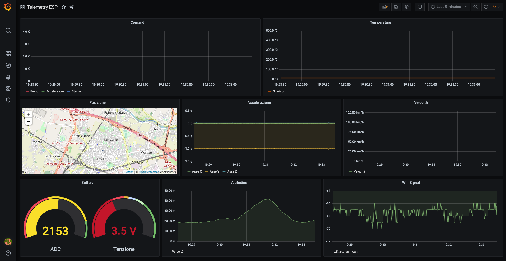

Any help is welcome! See the [contributions](CONTRIBUTING.md) guidelines.

# OpenTelemetry
Veichle generic telemetry based on ESP32 board connected via WIFI to a server with InfluxBD and Grafana.

Data acquisition is performed using an ESP32 board with custom firmware with a time precision of MicroSeconds.

Real telemetry is possible with a connection in real-time with a server (cloud is available) where is possible to load a dashboard like this screenshot.

## Actual status - PROTOTYPE
The actual prototype is under construction.
