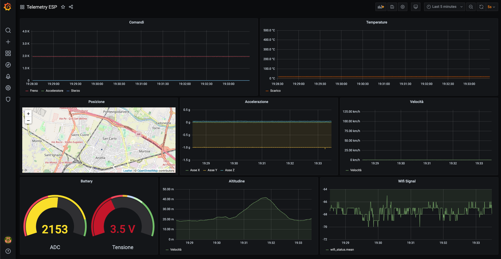

# Server

The server is able to receive raw data from the veichle board and display it using Grafana user interface.

[](#)

## Setup
Login as root user or append "sudo" command before each line.

```sh
$ apt update
$ apt install influxdb grafana -y
```

Edit the influxDB configuration file in /etc/influxdb/influxdb.conf.
Remove comment on the line of "precision" and set like this:
precision = "u"

```sh
$ service restart influxdb
```

Now create the user and database for telemetry
```sh
$ influx
Connected to http://localhost:8086✨ version 1.4.x ✨
InfluxDB shell version: 1.4.x
> CREATE USER "telemetry" WITH PASSWORD 'Your Password'
> CREATE DATABASE telemetry
> GRANT ALL ON "telemetry" TO "telemetry"
> EXIT
```

Now navigate on browser to "https://SERVER-IP:8086".

Configure the new datasource of InfluxDB with given credentials and database used on previous step.

Import the "Telemetry ESP-1602868268335.json" file to preconfigure the dashboard as the screenshot